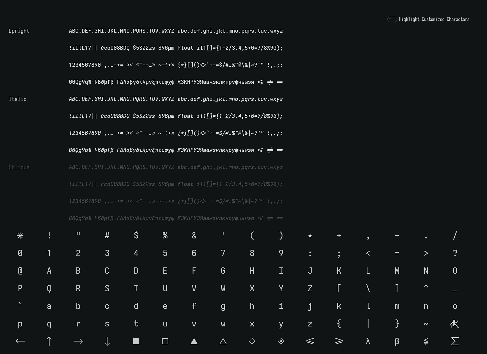
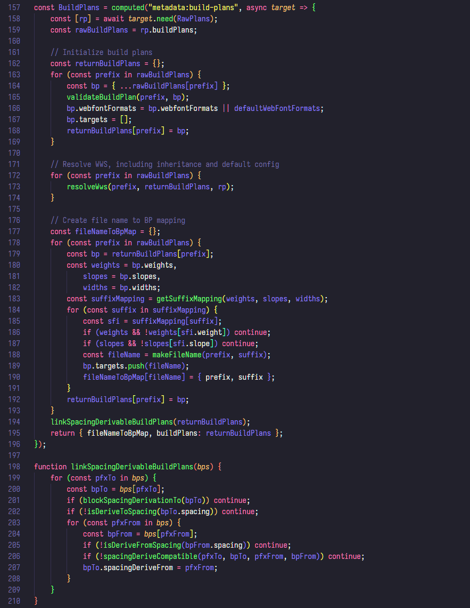
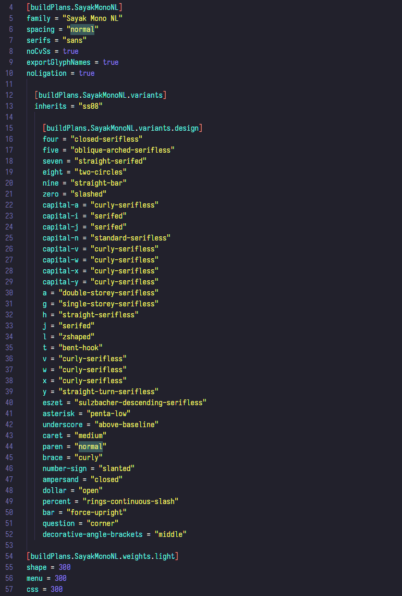

## Sayak Fonts

Monospaced fonts for coding and terminal based on Iosevka

### Variants
* **Sayak Mono** - Monospaced fonts including C-like ligatures
* **Sayak Mono Term** - Variant of Sayak Mono with narrower glyphs to fit columnar requirements of terminal applications
* **Sayak Mono NL** - Monospaced fonts without ligatures
* **Sayak Mono NL Term** - Specialized terminal variant of Sayak Mono NL

### Weights
The fonts come in four weights: Light, Regular, Medium, Bold. Every variant also comes with an italic slope.
Recommended font size is 11pt or 14px.

### Font

### Sample screenshots

### Installation instructions

Download the latest release from the Releases page and install using preferred method on your OS.

### Customize

1. Clone repository.
2. Edit `private-build-plans.toml` to customize glyphs, shapes, width and weights. 
3. Run `npm install`.
4. Run `npm run build -- ttf::`